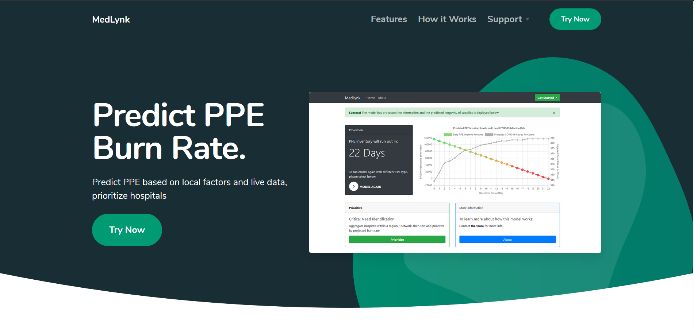

# MedLynk -  PPE Supply / Demand Prediction

**Note**: This repository holds the code only for the landing page. The actual code base for the project is still private. Feel free to reach out to seb.hollister@gatech.edu and I'd be happy to talk more about the project. 

**More Information**:
* MedLynk started as one of the **winners of the [MIT COVID-19 Hackathon]**(https://www.ece.gatech.edu/news/634109/three-tech-teams-among-winners-mit-covid-19-challenge-event).
* Devloped over Summer 2020 through **$4000 in funding from Georgia Tech CreateX Summer Launch Program**.
* Mentioned in **Harvard Business Review** (https://hbr.org/2020/07/turn-your-covid-19-solution-into-a-viable-business)

**Team**:
* [Maximilian Hollister (Georgia Tech BME '21)](https://www.linkedin.com/in/maximilianhollister/), [Akash Moozhayil(Georgia Tech ME '20)](https://www.linkedin.com/in/akash-moozhayil-723019142/), [Mike Adamo Georgia Tech BME '21](https://www.linkedin.com/in/mike-adamo/) & [Brandon D'arienzo Georgia Tech ME '21](https://www.linkedin.com/in/brandon-darienzo-767034171/)
* Developed by: [Sebastian Hollister Georgia Tech CS'21](https://www.linkedin.com/in/sebastian-hollister-625235152/)

### MedLynk Project Overview
* Allows hospital supply chain managers to predict their PPE (personal protective equipment) burn rate based on live local data and varying infection rates.
* Additionally, MedLynk provides a framework to not only predict COVID hotspots, but to also intelligently identify clinics that are most vulnerable to PPE supply inefficiencies. 
    * **What Makes a Clinic Vulnerable?**: The clinics we identified were smaller and most likely not part of a large hospital network. Additionally, there were over 20+ types of clinics we included, ranging from nursing homes to dentists. Since they were not plugged into a PPE supply network, and did not have access to GPOs (group purchasing organizations), these smaller clinics often struggled to secure PPE and fell under the radar. 
    * **Whats the Problem ?**: Within a county/metro area that we predicted would have a COVID spike within 2 weeks, there existed thousands of smaller clinics that fit the identity detailed above. Basically, there was a mismatch of supply. Re-tooled suppliers who shifted to manufacture PPE in order to keep their businesses alive were outsiders to the PPE game. They didn't have the contacts to get into big hospitals, and didn't have the research ability to identify all these small, at-risk clinics.
    * **How did MedLynk Help?**: MedLynk allowed us to **predict** the metro areas / rural counties that were most likely to see a spike in COVID cases within 2 weeks. Next, we could scrape dozens of public data sources to **identify** every possible clinic / firm that would need PPE in those counties. Finally, we intelligently **filtered** the list to identify the clinics that had the most critical need, and would most likely struggle to secure PPE. We compiled this list of thousands of clinics, included contact info and dozens of other data points, and sent the list to retooled suppliers so they could redirect their sales team.
    * **Impact**: We **worked with 2 re-tooled suppliers** in the Atlanta area who utilized our generated clinic lists. By doing so, we helped them supply PPE to clinics that they might not have otherwise been aware of. 

### Tools Used
* Web Framework: Flask
* Database: MongoDB (Atlas Cloud implmentation)
* Deep Learning: PyTorch
* Other Python Libraries: Heavily relied on Pandas, Numpy, bs4.
* Custom Javascript, CSS, HTML, Jinja used for frontend. Charts.js for graphs.

### Homepage Screenshot

